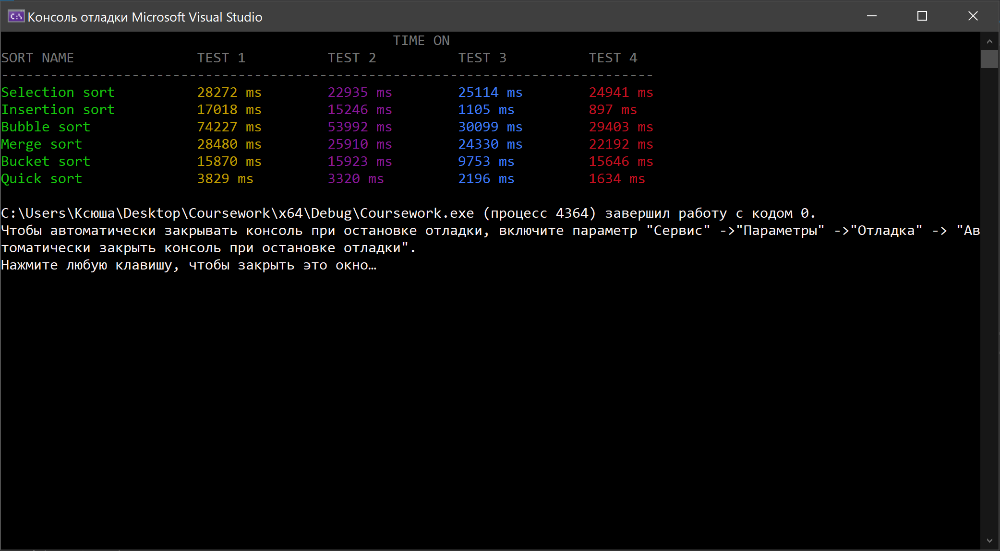

# Coursework

## Theme: Time and space complexity comparison of sorting algorithms
      
      
### Example of program execution

👩🏻‍💻  [@Ksuvot](https://github.com/Ksuvot) - *student*  
👨🏻‍💼 [@Evslav](https://github.com/Evslav) - *Academic supervisor*
